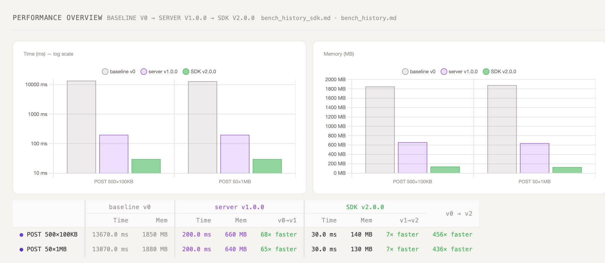
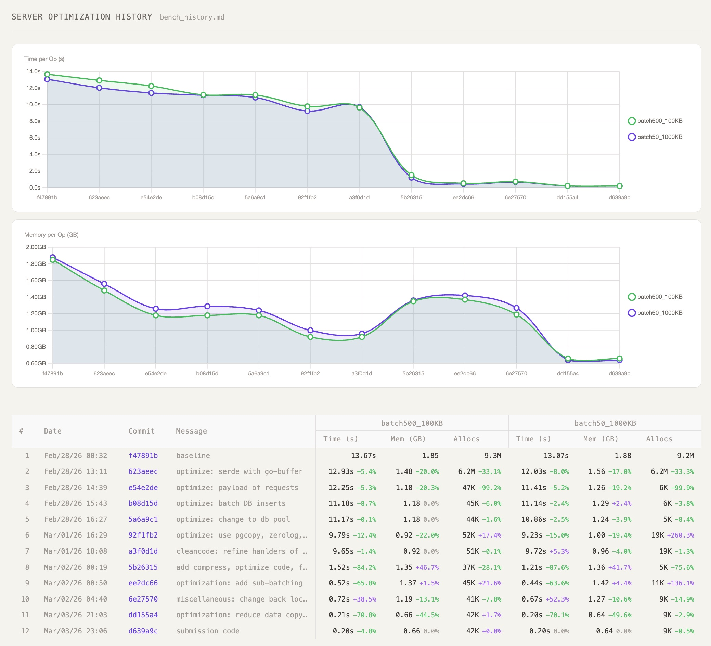

# Sialia Project

github: https://github.com/feiyang3cat/sialia

## Client-side Solution (v2)

Should read the server-side solution first to understand the problem and the solution. This part is put here for it is the final solution for the problem.

(1)
From trace of v1, we can find 60% of the latency is spent on decoding
the http request into a json object which contains large input/output data.
If SDK uploads only the ref data to the server and input/output directly to S3, this extra step is reduced. And the latency is expected to be reduced as well.

(2)
Also we can leverage client-side CPU for compression, and reuse the memory of the client-side for input/output data (in whichever case, the client-side need to set buffer for the input/output data). 

## Server-heavy Solution (v1)

### (A) Performance Related
#### Major Changes that Brought the Most Impact

| Area    | Improvement | Changes                                                                                                                                   |
| ------- | ----------- | ----------------------------------------------------------------------------------------------------------------------------------------- |
| Memory  | 50%         | Changed data structure in S3 and Postgres to reduce redundant buffer for input/output manipulation (input/output take 99% of the payload) |
| Latency | 80%         | 1. Sub-batches and parallelization for uploading 2. Compression for input/output (changed from gzip to zstd after submission)          |

#### Minor Optimizations

| Change                          | Impact                  | Implemented By                   |
| ------------------------------- | ----------------------- | -------------------------------- |
| golang-json -> `go-json`        | both latency and memory | asked cc to implement the change |
| logging -> `zerolog`            | both latency and memory | asked cc to implement the change |
| connection pooling for database | latency (very minor)    | asked cc to implement the change |

#### Tools for Performance Analysis

| Tool                                 | Purpose          | Status                                 |
| ------------------------------------ | ---------------- | -------------------------------------- |
| tracing (open-tracing + OpenObserve) | latency analysis | in use                                 |
| profiling (pprof)                    | memory analysis  | in use                                 |
| profiling (perf)                     | CPU analysis     | not yet used (mainly io-bound latency) |

### (B) Code Organization

| Area             | Change                                                                                                                      | Implemented By                   |
| ---------------- | --------------------------------------------------------------------------------------------------------------------------- | -------------------------------- |
| Structure        | Moving into internal package; split into main.go, s3.go, postgres.go, etc.; internal functions are more atomic and reusable | changed by me                    |
| Dependencies     | use dependency injection to manage initialization of singletons: fx; logging framework: zerolog                             | asked cc to implement the change |
| Commands & Tools | make bench-record (bench, recording, frontend analysis)                                                                     | asked cc to implement the change |

### (C) Working Pipeline -> designed by me, asked cc to implement the change
- change code
- `make test` to ensure correctness
- `make bench-record` to record the benchmark and performance metrics
- `make show-br` to show the benchmark and performance metrics

### Major Dependencies of the server-side solution

| Package                      | Version | Purpose                                              | Introduced By |
| ---------------------------- | ------- | ---------------------------------------------------- | ------------- |
| github.com/goccy/go-json     | v0.10.5 | fastest JSON library compatible with golang-json     | me            |
| github.com/rs/zerolog        | v1.34.0 | structured logging library                           | me            |
| go.uber.org/fx               | v1.24.0 | Dependency injection library for managing singletons | me            |
| github.com/aws/aws-sdk-go-v2 | v1.41.2 | S3 client                                            | existing      |
| github.com/jackc/pgx/v5      | v5.7.5  | PostgreSQL client                                    | existing      |
| github.com/go-chi/chi/v5     | v5.1.0  | HTTP router                                          | existing      |
| go.opentelemetry.io/otel     | v1.42.0 | OpenTelemetry library for tracing                    | existing      |
| github.com/joho/godotenv     | v1.5.1  | load environment variables from .env file            | existing      |
